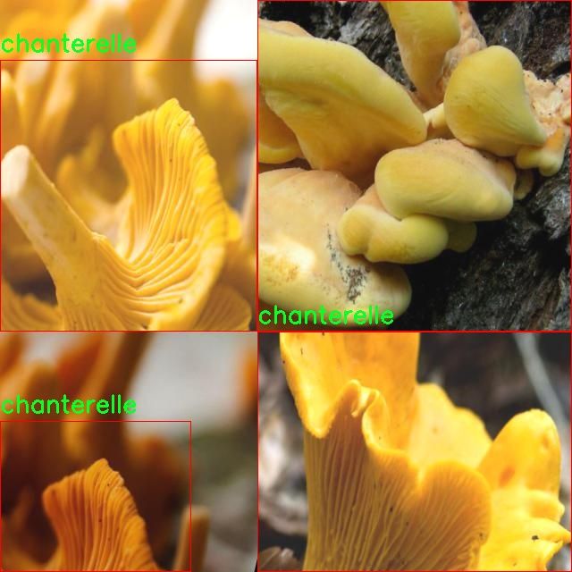

# 改进yolo11-GhostDynamicConv等200+全套创新点大全：北美蘑菇检测系统源码＆数据集全套

### 1.图片效果展示


##### 项目来源 **[人工智能促进会 2024.11.01](https://kdocs.cn/l/cszuIiCKVNis)**

注意：由于项目一直在更新迭代，上面“1.图片效果展示”和“2.视频效果展示”展示的系统图片或者视频可能为老版本，新版本在老版本的基础上升级如下：（实际效果以升级的新版本为准）

  （1）适配了YOLOV11的“目标检测”模型和“实例分割”模型，通过加载相应的权重（.pt）文件即可自适应加载模型。

  （2）支持“图片识别”、“视频识别”、“摄像头实时识别”三种识别模式。

  （3）支持“图片识别”、“视频识别”、“摄像头实时识别”三种识别结果保存导出，解决手动导出（容易卡顿出现爆内存）存在的问题，识别完自动保存结果并导出到tempDir中。

  （4）支持Web前端系统中的标题、背景图等自定义修改。

  另外本项目提供训练的数据集和训练教程,暂不提供权重文件（best.pt）,需要您按照教程进行训练后实现图片演示和Web前端界面演示的效果。

### 2.视频效果展示

[2.1 视频效果展示](https://www.bilibili.com/video/BV1DpSdYuENf/)

### 3.背景

研究背景与意义

随着全球生态环境的变化，蘑菇的种类和分布情况日益受到关注。北美地区以其丰富的生物多样性而闻名，尤其是多种可食用和药用蘑菇的存在，使得蘑菇的检测与分类成为一个重要的研究领域。传统的蘑菇识别方法主要依赖于专家的经验和知识，然而这种方法不仅耗时耗力，而且容易受到主观因素的影响。因此，开发一种高效、准确的自动化蘑菇检测系统显得尤为重要。

在这一背景下，基于改进YOLOv11的北美蘑菇检测系统应运而生。YOLO（You Only Look Once）系列模型因其在目标检测任务中的高效性和准确性而广受欢迎。通过对YOLOv11进行改进，我们能够在保持高检测速度的同时，提升对不同蘑菇种类的识别精度。本项目将利用一个包含51张图像的北美蘑菇数据集，涵盖了三类蘑菇，包括CoW（Cow Mushroom）和Chanterelle（鸡腿菇），为模型的训练和验证提供了基础。

本研究不仅有助于推动计算机视觉技术在生物多样性保护和食品安全领域的应用，还将为蘑菇爱好者和专业采集者提供一种便捷的识别工具，降低误食有毒蘑菇的风险。此外，通过对北美蘑菇的深入研究，我们能够更好地理解其生态环境及其在生态系统中的作用，为未来的生态保护和可持续发展提供科学依据。因此，基于改进YOLOv11的北美蘑菇检测系统的研究具有重要的理论价值和实际意义。

### 4.数据集信息展示

##### 4.1 本项目数据集详细数据（类别数＆类别名）

nc: 2
names: ['CoW', 'chanterelle']


该项目为【目标检测】数据集，请在【训练教程和Web端加载模型教程（第三步）】这一步的时候按照【目标检测】部分的教程来训练

##### 4.2 本项目数据集信息介绍

本项目数据集信息介绍

本项目所使用的数据集名为“North American Mushrooms”，旨在为改进YOLOv11的北美蘑菇检测系统提供高质量的训练数据。该数据集专注于两种特定的蘑菇类别，分别为“CoW”（牛肝菌）和“chanterelle”（鸡腿菇），共计包含两类。这一数据集的构建过程经过精心设计，确保了数据的多样性和代表性，以便于模型在实际应用中能够准确识别和分类这两种蘑菇。

在数据集的收集过程中，研究团队从北美的多个生态区域采集了大量的蘑菇样本，确保涵盖不同生长环境、季节变化以及光照条件下的蘑菇图像。这种多样性不仅提高了模型的泛化能力，也使得其在面对现实世界中的各种复杂情况时，能够保持较高的识别准确率。此外，数据集中的图像经过专业的标注和分类，确保每一张图像都清晰地标识出蘑菇的种类和特征，为YOLOv11的训练提供了坚实的基础。

为了进一步增强数据集的实用性，研究团队还对图像进行了预处理，包括图像增强、裁剪和缩放等操作。这些步骤旨在提高模型对不同尺寸和角度的蘑菇的识别能力，使其在实际应用中能够更好地适应各种环境条件。通过这一系列的努力，数据集“North American Mushrooms”不仅为YOLOv11的训练提供了丰富的样本，还为后续的研究和应用奠定了坚实的基础。最终，我们期望通过这一项目，能够有效提升北美蘑菇的自动检测和分类能力，为相关领域的研究和应用提供有力支持。




### 5.全套项目环境部署视频教程（零基础手把手教学）

[5.1 所需软件PyCharm和Anaconda安装教程（第一步）](https://www.bilibili.com/video/BV1BoC1YCEKi/?spm_id_from=333.999.0.0&vd_source=bc9aec86d164b67a7004b996143742dc)


[5.2 安装Python虚拟环境创建和依赖库安装视频教程（第二步）](https://www.bilibili.com/video/BV1ZoC1YCEBw?spm_id_from=333.788.videopod.sections&vd_source=bc9aec86d164b67a7004b996143742dc)

### 6.改进YOLOv11训练教程和Web_UI前端加载模型教程（零基础手把手教学）

[6.1 改进YOLOv11训练教程和Web_UI前端加载模型教程（第三步）](https://www.bilibili.com/video/BV1BoC1YCEhR?spm_id_from=333.788.videopod.sections&vd_source=bc9aec86d164b67a7004b996143742dc)


按照上面的训练视频教程链接加载项目提供的数据集，运行train.py即可开始训练



     Epoch   gpu_mem       box       obj       cls    labels  img_size
     1/200     20.8G   0.01576   0.01955  0.007536        22      1280: 100%|██████████| 849/849 [14:42<00:00,  1.04s/it]
               Class     Images     Labels          P          R     mAP@.5 mAP@.5:.95: 100%|██████████| 213/213 [01:14<00:00,  2.87it/s]
                 all       3395      17314      0.994      0.957      0.0957      0.0843

     Epoch   gpu_mem       box       obj       cls    labels  img_size
     2/200     20.8G   0.01578   0.01923  0.007006        22      1280: 100%|██████████| 849/849 [14:44<00:00,  1.04s/it]
               Class     Images     Labels          P          R     mAP@.5 mAP@.5:.95: 100%|██████████| 213/213 [01:12<00:00,  2.95it/s]
                 all       3395      17314      0.996      0.956      0.0957      0.0845

     Epoch   gpu_mem       box       obj       cls    labels  img_size
     3/200     20.8G   0.01561    0.0191  0.006895        27      1280: 100%|██████████| 849/849 [10:56<00:00,  1.29it/s]
               Class     Images     Labels          P          R     mAP@.5 mAP@.5:.95: 100%|███████   | 187/213 [00:52<00:00,  4.04it/s]
                 all       3395      17314      0.996      0.957      0.0957      0.0845


###### [项目数据集下载链接](https://kdocs.cn/l/cszuIiCKVNis)

### 7.原始YOLOv11算法讲解


###### YOLOv11改进方向

与YOLOv 10相比，YOLOv 11有了巨大的改进，包括但不限于：

  * 增强的模型结构：模型具有改进的模型结构，以获取图像处理并形成预测
  * GPU优化：这是现代ML模型的反映，GPU训练ML模型在速度和准确性上都更好。
  * 速度：YOLOv 11模型现在经过增强和GPU优化以用于训练。通过优化，这些模型比它们的前版本快得多。在速度上达到了25%的延迟减少！
  * 更少的参数：更少的参数允许更快的模型，但v11的准确性不受影响
  * 更具适应性：更多支持的任务YOLOv 11支持多种类型的任务、多种类型的对象和多种类型的图像。

###### YOLOv11功能介绍

Glenn Jocher和他的团队制作了一个令人敬畏的YOLOv 11迭代，并且在图像人工智能的各个方面都提供了YOLO。YOLOv 11有多种型号，包括：

  * 对象检测-在训练时检测图像中的对象
  * 图像分割-超越对象检测，分割出图像中的对象
  * 姿态检测-当用点和线训练时绘制一个人的姿势
  * 定向检测（OBB）：类似于对象检测，但包围盒可以旋转
  * 图像分类-在训练时对图像进行分类

使用Ultralytics Library，这些模型还可以进行优化，以：

  * 跟踪-可以跟踪对象的路径
  * 易于导出-库可以以不同的格式和目的导出
  * 多场景-您可以针对不同的对象和图像训练模型

此外，Ultralytics还推出了YOLOv 11的企业模型，该模型将于10月31日发布。这将与开源的YOLOv
11模型并行，但将拥有更大的专有Ultralytics数据集。YOLOv 11是“建立在过去的成功”的其他版本的之上。

###### YOLOv11模型介绍

YOLOv 11附带了边界框模型（无后缀），实例分割（-seg），姿态估计（-pose），定向边界框（-obb）和分类（-cls）。

这些也有不同的尺寸：纳米（n），小（s），中（m），大（l），超大（x）。


YOLOv11模型

###### YOLOv11与前版本对比

与YOLOv10和YOLOv8相比，YOLOv11在Ultralytics的任何帖子中都没有直接提到。所以我会收集所有的数据来比较它们。感谢Ultralytics：

**检测：**


YOLOv11检测统计


YOLOv10检测统计

其中，Nano的mAPval在v11上为39.5，v10上为38.5；Small为47.0 vs 46.3，Medium为51.5 vs
51.1，Large为53.4 vs 53.2，Extra Large为54.7vs
54.4。现在，这可能看起来像是一种增量增加，但小小数的增加可能会对ML模型产生很大影响。总体而言，YOLOv11以0.3
mAPval的优势追平或击败YOLOv10。

现在，我们必须看看速度。在延迟方面，Nano在v11上为1.55 , v10上为1.84，Small为2.46 v2.49，Medium为4.70
v4.74，Large为6.16 v7.28，Extra Large为11.31
v10.70。延迟越低越好。YOLOv11提供了一个非常低的延迟相比，除了特大做得相当差的前身。

总的来说，Nano模型是令人振奋的，速度更快，性能相当。Extra Large在性能上有很好的提升，但它的延迟非常糟糕。

**分割：**


YOLOV11 分割统计


YOLOV9 分割统计


YOLOV8 分割数据

总体而言，YOLOv 11上的分割模型在大型和超大型模型方面比上一代YOLOv 8和YOLOv 9做得更好。

YOLOv 9 Segmentation没有提供任何关于延迟的统计数据。比较YOLOv 11延迟和YOLOv 8延迟，发现YOLOv 11比YOLOv
8快得多。YOLOv 11将大量GPU集成到他们的模型中，因此期望他们的模型甚至比CPU测试的基准更快！

姿态估计：


YOLOV11姿态估计统计


YOLOV8姿态估计统计

YOLOv 11的mAP 50 -95统计量也逐渐优于先前的YOLOv 8（除大型外）。然而，在速度方面，YOLOv
11姿势可以最大限度地减少延迟。其中一些延迟指标是版本的1/4！通过对这些模型进行GPU训练优化，我可以看到指标比显示的要好得多。

**定向边界框：**


YOLOv11 OBB统计


YOLOv8 OBB统计

OBB统计数据在mAP
50上并不是很好，只有非常小的改进，在某种程度上小于检测中的微小改进。然而，从v8到v11的速度减半，这表明YOLOv11在速度上做了很多努力。

**最后，分类：**


YOLOv 11 CLS统计


YOLOv8 CLS统计

从v8到v11，准确性也有了微小的提高。然而，速度大幅上升，CPU速度更快的型号。


### 8.200+种全套改进YOLOV11创新点原理讲解

#### 8.1 200+种全套改进YOLOV11创新点原理讲解大全

由于篇幅限制，每个创新点的具体原理讲解就不全部展开，具体见下列网址中的改进模块对应项目的技术原理博客网址【Blog】（创新点均为模块化搭建，原理适配YOLOv5~YOLOv11等各种版本）

[改进模块技术原理博客【Blog】网址链接](https://gitee.com/qunmasj/good)


#### 8.2 精选部分改进YOLOV11创新点原理讲解

###### 这里节选部分改进创新点展开原理讲解(完整的改进原理见上图和[改进模块技术原理博客链接](https://gitee.com/qunmasj/good)【如果此小节的图加载失败可以通过CSDN或者Github搜索该博客的标题访问原始博客，原始博客图片显示正常】


### Context_Grided_Network(CGNet)简介
参考该博客提出的一种轻量化语义分割模型Context Grided Network(CGNet)，以满足设备的运行需要。

CGNet主要由CG块构建而成，CG块可以学习局部特征和周围环境上下文的联合特征，最后通过引入全局上下文特征进一步改善联合特征的学习。


 
下图给出了在Cityscapes数据集上对现有的一些语义分割模型的测试效果，横轴表示参数量，纵轴表示准确率(mIoU)。可以看出，在参数量较少的情况下，CGNet可以达到一个比较好的准确率。虽与高精度模型相去甚远，但在一些对精度要求不高、对实时性要求比较苛刻的情况下，很有价值。


高精度模型，如DeepLab、DFN、DenseASPP等，动不动就是几十M的参数，很难应用在移动设备上。而上图中红色的模型，相对内存占用较小，但它们的分割精度却不是很高。作者认为主要原因是，这些小网络大多遵循着分类网络的设计思路，并没有考虑语义分割任务更深层次的特点。

空间依赖性和上下文信息对提高分割精度有很大的作用。作者从该角度出发，提出了CG block，并进一步搭建了轻量级语义分割网络CGNet。CG块具有以下特点： 

学习局部特征和上下文特征的联合特征；
通过全局上下文特征改进上述联合特征；
可以贯穿应用在整个网络中，从low level（空间级别）到high level（语义级别）。不像PSPNet、DFN、DenseASPP等，只在编码阶段以后捕捉上下文特征。；
只有3个下采样，相比一般5个下采样的网络，能够更好地保留边缘信息。
CGNet遵循“深而薄”的原则设计，整个网络又51层构成。其中，为了降低计算，大量使用了channel-wise conv.

小型语义分割模型：

需要平衡准确率和系统开销
进化路线：ENet -> ICNet -> ESPNet
这些模型基本都基于分类网络设计，在分割准确率上效果并不是很好
上下文信息模型：

大多数现有模型只考虑解码阶段的上下文信息并且没有利用周围的上下文信息
注意力机制：

CG block使用全局上下文信息计算权重向量，并使用其细化局部特征和周围上下文特征的联合特征

#### Context Guided Block
CG block由4部分组成：


此外，CG block还采用了残差学习。文中提出了局部残差学习（LRL）和全局残差学习（GRL）两种方式。 LRL添加了从输入到联合特征提取器的连接，GRL添加了从输入到全局特征提取器的连接。从直观上来说，GRL比LRL更能促进网络中的信息传递（更像ResNet~~），后面实验部分也进行了测试，的确GRL更能提升分割精度。


CGNet的通用网络结构如下图所示，分为3个stage，第一个stage使用3个卷积层抽取特征，第二和第三个stage堆叠一定数量的CG block，具体个数可以根据情况调整。最后，通过1x1 conv得到分割结果。


下图是用于Cityscapes数据集的CGNet网络细节说明：输入尺寸为3*680*680；stage1连续使用了3个Conv-BN-PReLU组合，首个组合使用了stride=2的卷积，所以得到了1/2分辨率的feature map；stage2和stage3分别使用了多个CG block，且其中使用了不同大小的膨胀卷积核，最终分别得到了1/4和1/8的feature map。

需注意：

stage2&3的输入特征分别由其上一个stage的首个和最后一个block组合给出（参考上图的绿色箭头）；

输入注入机制，图中未体现，实际使用中，作者还将输入图像下采样1/4或1/8，分别给到stage2和stage3的输入中 ，以进一步加强特征传递。

channel-wise conv。为了缩减参数数量，在局部特征提取器和周围上下文特征提取器中使用了channel-wise卷积，可以消除跨通道的计算成本，同时节省内存占用。但是，没有像MobileNet等模型一样，在depth-wise卷积后面接point-wise卷积（1*1 conv），作者解释是，因为CG block需要保持局部特征和周围上下文特征的独立性，而1*1 conv会破坏这种独立性，所以效果欠佳，实验部分也进行了验证。

个人感觉此处应该指的是depth-wise卷积？

官方Git中对该部分的实现如下：


### 9.系统功能展示

图9.1.系统支持检测结果表格显示

  图9.2.系统支持置信度和IOU阈值手动调节

  图9.3.系统支持自定义加载权重文件best.pt(需要你通过步骤5中训练获得)

  图9.4.系统支持摄像头实时识别

  图9.5.系统支持图片识别

  图9.6.系统支持视频识别

  图9.7.系统支持识别结果文件自动保存

  图9.8.系统支持Excel导出检测结果数据


### 10. YOLOv11核心改进源码讲解

#### 10.1 test_selective_scan_easy.py

以下是对给定代码的核心部分进行提炼和详细注释的结果。代码的主要功能是实现选择性扫描（Selective Scan）操作，通常用于处理序列数据的神经网络模型中。

```python
import torch
import torch.nn.functional as F

def selective_scan_easy(us, dts, As, Bs, Cs, Ds, delta_bias=None, delta_softplus=False, return_last_state=False, chunksize=64):
    """
    选择性扫描函数
    参数:
    us: 输入序列，形状为 (B, G * D, L)
    dts: 时间增量，形状为 (B, G * D, L)
    As: 系数矩阵，形状为 (G * D, N)
    Bs: 系数矩阵，形状为 (B, G, N, L)
    Cs: 系数矩阵，形状为 (B, G, N, L)
    Ds: 偏置项，形状为 (G * D)
    delta_bias: 偏置修正项，形状为 (G * D)
    delta_softplus: 是否应用softplus激活
    return_last_state: 是否返回最后的状态
    chunksize: 每次处理的序列长度
    返回:
    ys: 输出序列
    hs: 最后状态（可选）
    """
    
    def selective_scan_chunk(us, dts, As, Bs, Cs, hprefix):
        """
        处理每个块的选择性扫描
        参数:
        us: 输入序列块
        dts: 时间增量块
        As, Bs, Cs: 系数矩阵
        hprefix: 前一个状态
        返回:
        ys: 当前块的输出
        hs: 当前块的状态
        """
        ts = dts.cumsum(dim=0)  # 计算时间增量的累积和
        Ats = torch.einsum("gdn,lbgd->lbgdn", As, ts).exp()  # 计算A的指数
        scale = 1  # 归一化因子
        rAts = Ats / scale  # 归一化后的A
        duts = dts * us  # 计算duts
        dtBus = torch.einsum("lbgd,lbgn->lbgdn", duts, Bs)  # 计算dtBus
        hs_tmp = rAts * (dtBus / rAts).cumsum(dim=0)  # 当前状态的计算
        hs = hs_tmp + Ats * hprefix.unsqueeze(0)  # 更新状态
        ys = torch.einsum("lbgn,lbgdn->lbgd", Cs, hs)  # 计算输出
        return ys, hs

    # 数据类型设置
    dtype = torch.float32
    inp_dtype = us.dtype
    has_D = Ds is not None  # 检查Ds是否存在
    if chunksize < 1:
        chunksize = Bs.shape[-1]  # 设置块大小

    # 数据预处理
    dts = dts.to(dtype)
    if delta_bias is not None:
        dts = dts + delta_bias.view(1, -1, 1).to(dtype)  # 应用偏置修正
    if delta_softplus:
        dts = F.softplus(dts)  # 应用softplus激活

    # 数据形状调整
    Bs = Bs.unsqueeze(1) if len(Bs.shape) == 3 else Bs
    Cs = Cs.unsqueeze(1) if len(Cs.shape) == 3 else Cs
    B, G, N, L = Bs.shape
    us = us.view(B, G, -1, L).permute(3, 0, 1, 2).to(dtype)
    dts = dts.view(B, G, -1, L).permute(3, 0, 1, 2).to(dtype)
    As = As.view(G, -1, N).to(dtype)
    Bs = Bs.permute(3, 0, 1, 2).to(dtype)
    Cs = Cs.permute(3, 0, 1, 2).to(dtype)
    Ds = Ds.view(G, -1).to(dtype) if has_D else None
    D = As.shape[1]

    oys = []  # 存储输出
    hprefix = us.new_zeros((B, G, D, N), dtype=dtype)  # 初始化前一个状态
    for i in range(0, L, chunksize):
        ys, hs = selective_scan_chunk(
            us[i:i + chunksize], dts[i:i + chunksize], 
            As, Bs[i:i + chunksize], Cs[i:i + chunksize], hprefix, 
        )
        oys.append(ys)  # 收集输出
        hprefix = hs[-1]  # 更新前一个状态

    oys = torch.cat(oys, dim=0)  # 合并所有输出
    if has_D:
        oys = oys + Ds * us  # 应用偏置项
    oys = oys.permute(1, 2, 3, 0).view(B, -1, L)  # 调整输出形状

    return oys.to(inp_dtype) if not return_last_state else (oys.to(inp_dtype), hprefix.view(B, G * D, N).float())
```

### 代码分析
1. **选择性扫描函数**：`selective_scan_easy`是核心函数，负责处理输入序列并计算输出。
2. **块处理**：`selective_scan_chunk`是一个内部函数，用于处理每个块的计算，使用了累积和和指数运算。
3. **数据预处理**：在主函数中，输入数据会被转换为适当的形状和数据类型，并根据需要应用偏置和激活函数。
4. **输出收集**：在处理每个块后，输出会被收集并最终合并为一个完整的输出序列。

以上是对代码的核心部分的提炼和详细注释。希望这些信息能帮助您理解代码的功能和实现细节。

这个文件 `test_selective_scan_easy.py` 主要实现了一个名为 `selective_scan_easy` 的函数，该函数用于执行选择性扫描操作，通常用于处理序列数据，尤其是在深度学习模型中。该文件还包含了一些辅助函数和测试代码，使用 PyTorch 框架来实现计算和自动求导。

在文件的开头，导入了一些必要的库，包括 `torch` 和 `pytest`，以及一些用于张量操作的工具。接着定义了 `selective_scan_easy` 函数，该函数接受多个参数，包括输入张量 `us` 和 `dts`，以及一些矩阵 `As`、`Bs`、`Cs` 和 `Ds`，它们分别表示不同的权重和状态信息。

`selective_scan_easy` 函数的核心逻辑在于如何通过分块处理（chunking）来高效地计算输出。具体来说，函数内部定义了一个 `selective_scan_chunk` 函数，用于处理每个块的计算。该函数通过张量的逐步累加和矩阵乘法来更新状态和输出，使用了 PyTorch 的 `einsum` 函数来简化多维张量的操作。

在 `selective_scan_easy` 函数中，输入张量会被转换为适当的形状和数据类型，并根据需要应用偏置和激活函数。然后，函数会遍历序列的每个块，调用 `selective_scan_chunk` 来计算输出，并将结果拼接在一起。最终，函数返回计算得到的输出张量。

此外，文件中还定义了一个 `SelectiveScanEasy` 类，该类继承自 `torch.autograd.Function`，用于实现自定义的前向和反向传播操作。该类的 `forward` 方法实现了选择性扫描的前向计算，而 `backward` 方法则实现了反向传播，计算梯度。

文件的最后部分包含了一个测试函数 `test_selective_scan`，使用 `pytest` 框架对 `selective_scan_easy` 函数进行单元测试。测试中会生成随机输入数据，并与参考实现进行比较，以确保输出的一致性和正确性。测试参数化的设计使得可以在不同的输入配置下进行验证。

总体而言，这个文件展示了如何在深度学习中实现高效的选择性扫描操作，并通过自动求导机制支持反向传播，同时还提供了测试用例以确保实现的正确性。

#### 10.2 afpn.py

以下是经过简化和注释的核心代码部分：

```python
import torch
import torch.nn as nn
import torch.nn.functional as F
from ..modules.conv import Conv

# 定义基本的卷积块
class BasicBlock(nn.Module):
    def __init__(self, filter_in, filter_out):
        super(BasicBlock, self).__init__()
        # 定义两个卷积层
        self.conv1 = Conv(filter_in, filter_out, 3)
        self.conv2 = Conv(filter_out, filter_out, 3, act=False)

    def forward(self, x):
        residual = x  # 保存输入以便后续加和
        out = self.conv1(x)  # 第一个卷积
        out = self.conv2(out)  # 第二个卷积
        out += residual  # 残差连接
        return self.conv1.act(out)  # 激活函数

# 定义上采样模块
class Upsample(nn.Module):
    def __init__(self, in_channels, out_channels, scale_factor=2):
        super(Upsample, self).__init__()
        # 定义上采样的卷积和上采样操作
        self.upsample = nn.Sequential(
            Conv(in_channels, out_channels, 1),
            nn.Upsample(scale_factor=scale_factor, mode='bilinear')
        )

    def forward(self, x):
        return self.upsample(x)  # 上采样操作

# 定义下采样模块（2倍）
class Downsample_x2(nn.Module):
    def __init__(self, in_channels, out_channels):
        super(Downsample_x2, self).__init__()
        # 定义2倍下采样的卷积
        self.downsample = Conv(in_channels, out_channels, 2, 2, 0)

    def forward(self, x):
        return self.downsample(x)  # 下采样操作

# 定义自适应特征融合模块（ASFF）
class ASFF_2(nn.Module):
    def __init__(self, inter_dim=512):
        super(ASFF_2, self).__init__()
        compress_c = 8  # 压缩通道数
        # 定义权重卷积层
        self.weight_level_1 = Conv(inter_dim, compress_c, 1)
        self.weight_level_2 = Conv(inter_dim, compress_c, 1)
        self.weight_levels = nn.Conv2d(compress_c * 2, 2, kernel_size=1, stride=1, padding=0)
        self.conv = Conv(inter_dim, inter_dim, 3)  # 最后的卷积层

    def forward(self, input1, input2):
        # 计算权重
        level_1_weight_v = self.weight_level_1(input1)
        level_2_weight_v = self.weight_level_2(input2)
        levels_weight_v = torch.cat((level_1_weight_v, level_2_weight_v), 1)
        levels_weight = self.weight_levels(levels_weight_v)
        levels_weight = F.softmax(levels_weight, dim=1)  # 归一化权重

        # 融合输入特征
        fused_out_reduced = input1 * levels_weight[:, 0:1, :, :] + input2 * levels_weight[:, 1:2, :, :]
        out = self.conv(fused_out_reduced)  # 最后的卷积
        return out

# 定义特征金字塔网络（AFPN）
class AFPN_P345(nn.Module):
    def __init__(self, in_channels=[256, 512, 1024], out_channels=256, factor=4):
        super(AFPN_P345, self).__init__()
        # 定义输入通道到输出通道的卷积
        self.conv0 = Conv(in_channels[0], in_channels[0] // factor, 1)
        self.conv1 = Conv(in_channels[1], in_channels[1] // factor, 1)
        self.conv2 = Conv(in_channels[2], in_channels[2] // factor, 1)

        # 定义特征块
        self.body = BlockBody_P345([in_channels[0] // factor, in_channels[1] // factor, in_channels[2] // factor])

        # 定义输出卷积
        self.conv00 = Conv(in_channels[0] // factor, out_channels, 1)
        self.conv11 = Conv(in_channels[1] // factor, out_channels, 1)
        self.conv22 = Conv(in_channels[2] // factor, out_channels, 1)

    def forward(self, x):
        x0, x1, x2 = x  # 输入特征
        x0 = self.conv0(x0)  # 卷积处理
        x1 = self.conv1(x1)
        x2 = self.conv2(x2)

        out0, out1, out2 = self.body([x0, x1, x2])  # 特征块处理

        out0 = self.conv00(out0)  # 输出卷积
        out1 = self.conv11(out1)
        out2 = self.conv22(out2)
        return [out0, out1, out2]  # 返回输出特征
```

### 代码说明：
1. **BasicBlock**: 定义了一个基本的卷积块，包含两个卷积层和残差连接。
2. **Upsample 和 Downsample**: 定义了上采样和下采样模块，使用卷积和插值方法调整特征图的尺寸。
3. **ASFF_2**: 自适应特征融合模块，计算输入特征的权重并融合特征。
4. **AFPN_P345**: 特征金字塔网络的实现，处理输入特征并输出经过卷积处理的特征图。

以上是代码的核心部分及其详细注释，去除了冗余的部分，保留了主要功能。

这个程序文件 `afpn.py` 实现了一个自适应特征金字塔网络（AFPN），用于计算机视觉任务中的特征提取和融合。代码中定义了多个类，主要包括基本模块、上采样和下采样模块、特征融合模块以及特定结构的网络体。

首先，`BasicBlock` 类定义了一个基本的卷积块，包含两个卷积层和残差连接。这个块在前向传播中会将输入通过两个卷积层处理，并将输入直接加到输出上，形成残差连接。

接下来，`Upsample` 和 `Downsample_x2`、`Downsample_x4`、`Downsample_x8` 类分别实现了上采样和不同倍数的下采样功能。上采样使用了卷积和双线性插值，下采样则通过卷积实现。

`ASFF_2`、`ASFF_3` 和 `ASFF_4` 类实现了自适应特征融合模块，分别用于处理2、3和4个输入特征图。每个模块通过学习的权重对输入特征进行加权融合，并通过卷积层进行处理，最终输出融合后的特征图。

`BlockBody_P345` 和 `BlockBody_P2345` 类分别实现了包含多个卷积块和自适应特征融合模块的网络体。它们的构造函数中定义了不同尺度的卷积块和下采样、上采样模块，并在前向传播中依次处理输入特征图，进行特征融合和处理。

`AFPN_P345` 和 `AFPN_P2345` 类则是完整的自适应特征金字塔网络实现，分别处理3个和4个输入特征图。它们在构造函数中定义了初始卷积层、网络体和输出卷积层，并在前向传播中依次处理输入特征图，得到最终的输出特征图。

最后，`BlockBody_P345_Custom` 和 `BlockBody_P2345_Custom` 类允许用户自定义块类型，通过传入不同的块类型实现灵活的网络结构。

整个程序利用了 PyTorch 框架的模块化设计，便于构建和训练深度学习模型，适用于目标检测、图像分割等任务。

#### 10.3 dynamic_snake_conv.py

以下是代码的核心部分，并附上详细的中文注释：

```python
import torch
import torch.nn as nn
from ..modules.conv import Conv

__all__ = ['DySnakeConv']

class DySnakeConv(nn.Module):
    def __init__(self, inc, ouc, k=3) -> None:
        super().__init__()
        
        # 初始化三个卷积层
        self.conv_0 = Conv(inc, ouc, k)  # 标准卷积
        self.conv_x = DSConv(inc, ouc, 0, k)  # 沿x轴的动态蛇形卷积
        self.conv_y = DSConv(inc, ouc, 1, k)  # 沿y轴的动态蛇形卷积
    
    def forward(self, x):
        # 前向传播，返回三个卷积的拼接结果
        return torch.cat([self.conv_0(x), self.conv_x(x), self.conv_y(x)], dim=1)

class DSConv(nn.Module):
    def __init__(self, in_ch, out_ch, morph, kernel_size=3, if_offset=True, extend_scope=1):
        """
        动态蛇形卷积
        :param in_ch: 输入通道数
        :param out_ch: 输出通道数
        :param kernel_size: 卷积核大小
        :param extend_scope: 扩展范围（默认1）
        :param morph: 卷积核的形态，主要分为沿x轴（0）和y轴（1）
        :param if_offset: 是否需要偏移，如果为False，则为标准卷积核
        """
        super(DSConv, self).__init__()
        # 用于学习可变形偏移的卷积层
        self.offset_conv = nn.Conv2d(in_ch, 2 * kernel_size, 3, padding=1)
        self.bn = nn.BatchNorm2d(2 * kernel_size)  # 批归一化
        self.kernel_size = kernel_size

        # 定义沿x轴和y轴的动态蛇形卷积
        self.dsc_conv_x = nn.Conv2d(
            in_ch,
            out_ch,
            kernel_size=(kernel_size, 1),
            stride=(kernel_size, 1),
            padding=0,
        )
        self.dsc_conv_y = nn.Conv2d(
            in_ch,
            out_ch,
            kernel_size=(1, kernel_size),
            stride=(1, kernel_size),
            padding=0,
        )

        self.gn = nn.GroupNorm(out_ch // 4, out_ch)  # 组归一化
        self.act = Conv.default_act  # 默认激活函数

        self.extend_scope = extend_scope
        self.morph = morph
        self.if_offset = if_offset

    def forward(self, f):
        # 前向传播
        offset = self.offset_conv(f)  # 计算偏移
        offset = self.bn(offset)  # 批归一化
        offset = torch.tanh(offset)  # 将偏移限制在[-1, 1]之间
        input_shape = f.shape
        dsc = DSC(input_shape, self.kernel_size, self.extend_scope, self.morph)  # 初始化DSC对象
        deformed_feature = dsc.deform_conv(f, offset, self.if_offset)  # 进行可变形卷积
        
        # 根据形态选择不同的卷积
        if self.morph == 0:
            x = self.dsc_conv_x(deformed_feature.type(f.dtype))
        else:
            x = self.dsc_conv_y(deformed_feature.type(f.dtype))
        
        x = self.gn(x)  # 组归一化
        x = self.act(x)  # 激活函数
        return x

class DSC(object):
    def __init__(self, input_shape, kernel_size, extend_scope, morph):
        self.num_points = kernel_size  # 卷积核的点数
        self.width = input_shape[2]  # 输入特征图的宽度
        self.height = input_shape[3]  # 输入特征图的高度
        self.morph = morph  # 卷积核形态
        self.extend_scope = extend_scope  # 偏移范围

        # 定义特征图的形状
        self.num_batch = input_shape[0]  # 批次大小
        self.num_channels = input_shape[1]  # 通道数

    def deform_conv(self, input, offset, if_offset):
        # 进行可变形卷积
        y, x = self._coordinate_map_3D(offset, if_offset)  # 计算坐标图
        deformed_feature = self._bilinear_interpolate_3D(input, y, x)  # 双线性插值
        return deformed_feature

    def _coordinate_map_3D(self, offset, if_offset):
        # 计算3D坐标图
        # 省略具体实现，返回y和x坐标
        pass

    def _bilinear_interpolate_3D(self, input_feature, y, x):
        # 进行3D双线性插值
        # 省略具体实现，返回插值结果
        pass
```

### 代码说明：
1. **DySnakeConv** 类：定义了一个动态蛇形卷积层，包含一个标准卷积和两个动态蛇形卷积（分别沿x轴和y轴）。
2. **DSConv** 类：实现了动态蛇形卷积的具体操作，包括偏移的学习和特征图的变形。
3. **DSC** 类：负责计算坐标图和进行双线性插值，最终实现可变形卷积的功能。
4. **前向传播**：通过调用各个卷积层，完成输入特征图的处理，并返回处理后的结果。

这个程序文件 `dynamic_snake_conv.py` 实现了一个动态蛇形卷积（Dynamic Snake Convolution）的神经网络模块，主要用于图像处理任务。该模块的核心是 `DySnakeConv` 和 `DSConv` 类，结合了标准卷积和动态变形卷积的特性。

在 `DySnakeConv` 类中，构造函数初始化了三个卷积层：`conv_0` 是一个标准卷积，`conv_x` 和 `conv_y` 是动态蛇形卷积，分别沿着 x 轴和 y 轴进行操作。`forward` 方法接收输入张量 `x`，并将三个卷积的输出在通道维度上拼接起来，形成最终的输出。

`DSConv` 类实现了动态蛇形卷积的具体逻辑。构造函数中，定义了输入和输出通道数、卷积核大小、形态参数等。该类的 `forward` 方法首先通过一个卷积层 `offset_conv` 计算出偏移量，然后使用 `DSC` 类来生成变形后的特征图。根据 `morph` 参数的不同，选择不同的卷积操作（沿 x 轴或 y 轴）来处理变形后的特征图，并通过归一化和激活函数进行处理。

`DSC` 类负责生成坐标映射和进行双线性插值。它包含了多个方法，首先 `_coordinate_map_3D` 用于根据偏移量生成新的坐标映射。然后 `_bilinear_interpolate_3D` 方法根据生成的坐标对输入特征图进行双线性插值，得到变形后的特征图。最后，`deform_conv` 方法将这些功能结合起来，完成动态蛇形卷积的计算。

整体来看，这个程序实现了一个灵活且高效的卷积模块，能够在图像处理任务中适应不同的形态变化，增强了卷积神经网络的表达能力。

#### 10.4 attention.py

以下是经过简化和注释的核心代码部分，主要集中在几个重要的注意力机制模块上。

```python
import torch
from torch import nn
import torch.nn.functional as F

class EMA(nn.Module):
    """Exponential Moving Average (EMA) Module"""
    def __init__(self, channels, factor=8):
        super(EMA, self).__init__()
        self.groups = factor  # 分组数
        assert channels // self.groups > 0  # 确保每组至少有一个通道
        self.softmax = nn.Softmax(-1)  # Softmax用于权重计算
        self.agp = nn.AdaptiveAvgPool2d((1, 1))  # 自适应平均池化
        self.pool_h = nn.AdaptiveAvgPool2d((None, 1))  # 针对高度的池化
        self.pool_w = nn.AdaptiveAvgPool2d((1, None))  # 针对宽度的池化
        self.gn = nn.GroupNorm(channels // self.groups, channels // self.groups)  # 分组归一化
        self.conv1x1 = nn.Conv2d(channels // self.groups, channels // self.groups, kernel_size=1)  # 1x1卷积
        self.conv3x3 = nn.Conv2d(channels // self.groups, channels // self.groups, kernel_size=3, padding=1)  # 3x3卷积

    def forward(self, x):
        b, c, h, w = x.size()  # 获取输入的尺寸
        group_x = x.reshape(b * self.groups, -1, h, w)  # 重新调整为分组格式
        x_h = self.pool_h(group_x)  # 对高度进行池化
        x_w = self.pool_w(group_x).permute(0, 1, 3, 2)  # 对宽度进行池化并转置
        hw = self.conv1x1(torch.cat([x_h, x_w], dim=2))  # 1x1卷积处理
        x_h, x_w = torch.split(hw, [h, w], dim=2)  # 分割回高度和宽度
        x1 = self.gn(group_x * x_h.sigmoid() * x_w.permute(0, 1, 3, 2).sigmoid())  # 应用sigmoid激活
        x2 = self.conv3x3(group_x)  # 3x3卷积处理
        # 计算权重
        x11 = self.softmax(self.agp(x1).reshape(b * self.groups, -1, 1).permute(0, 2, 1))
        x12 = x2.reshape(b * self.groups, c // self.groups, -1)  # 重新调整
        x21 = self.softmax(self.agp(x2).reshape(b * self.groups, -1, 1).permute(0, 2, 1))
        x22 = x1.reshape(b * self.groups, c // self.groups, -1)  # 重新调整
        weights = (torch.matmul(x11, x12) + torch.matmul(x21, x22)).reshape(b * self.groups, 1, h, w)  # 计算最终权重
        return (group_x * weights.sigmoid()).reshape(b, c, h, w)  # 返回加权后的输出

class SimAM(nn.Module):
    """Similarity Attention Module (SimAM)"""
    def __init__(self, e_lambda=1e-4):
        super(SimAM, self).__init__()
        self.activaton = nn.Sigmoid()  # Sigmoid激活函数
        self.e_lambda = e_lambda  # 正则化参数

    def forward(self, x):
        b, c, h, w = x.size()  # 获取输入的尺寸
        n = w * h - 1  # 计算总的元素数量
        # 计算均值中心化后的平方
        x_minus_mu_square = (x - x.mean(dim=[2, 3], keepdim=True)).pow(2)
        # 计算注意力权重
        y = x_minus_mu_square / (4 * (x_minus_mu_square.sum(dim=[2, 3], keepdim=True) / n + self.e_lambda)) + 0.5
        return x * self.activaton(y)  # 返回加权后的输出

class SpatialGroupEnhance(nn.Module):
    """Spatial Group Enhancement Module"""
    def __init__(self, groups=8):
        super().__init__()
        self.groups = groups  # 分组数
        self.avg_pool = nn.AdaptiveAvgPool2d(1)  # 自适应平均池化
        self.weight = nn.Parameter(torch.zeros(1, groups, 1, 1))  # 权重参数
        self.bias = nn.Parameter(torch.zeros(1, groups, 1, 1))  # 偏置参数
        self.sig = nn.Sigmoid()  # Sigmoid激活函数
        self.init_weights()  # 初始化权重

    def init_weights(self):
        for m in self.modules():
            if isinstance(m, nn.Conv2d):
                nn.init.kaiming_normal_(m.weight, mode='fan_out')  # Kaiming初始化
                if m.bias is not None:
                    nn.init.constant_(m.bias, 0)  # 偏置初始化为0

    def forward(self, x):
        b, c, h, w = x.shape  # 获取输入的尺寸
        x = x.view(b * self.groups, -1, h, w)  # 重新调整为分组格式
        xn = x * self.avg_pool(x)  # 加权平均
        xn = xn.sum(dim=1, keepdim=True)  # 对分组求和
        t = xn.view(b * self.groups, -1)  # 重新调整
        t = t - t.mean(dim=1, keepdim=True)  # 均值中心化
        std = t.std(dim=1, keepdim=True) + 1e-5  # 计算标准差
        t = t / std  # 归一化
        t = t.view(b, self.groups, h, w)  # 重新调整
        t = t * self.weight + self.bias  # 应用权重和偏置
        t = t.view(b * self.groups, 1, h, w)  # 重新调整
        x = x * self.sig(t)  # 应用sigmoid激活
        x = x.view(b, c, h, w)  # 返回到原始形状
        return x
```

### 代码说明：
1. **EMA (Exponential Moving Average)**: 该模块实现了指数移动平均的计算，通过对输入特征进行分组处理，计算出加权的输出特征。

2. **SimAM (Similarity Attention Module)**: 该模块计算输入特征的相似性注意力，通过均值中心化和平方计算，生成注意力权重并加权输入特征。

3. **SpatialGroupEnhance**: 该模块通过自适应平均池化和分组操作增强空间特征，利用sigmoid激活函数生成权重并加权输入特征。

这些模块是深度学习模型中常用的注意力机制，能够增强模型对特征的关注能力。

这个程序文件 `attention.py` 实现了一系列的注意力机制模块，主要用于深度学习中的视觉任务，特别是在图像处理和计算机视觉领域。文件中包含了多个类，每个类代表一种特定的注意力机制或相关操作。

首先，文件导入了必要的库，包括 PyTorch、Torchvision 以及一些自定义模块。然后，定义了一些常用的注意力机制，如 EMA（Exponential Moving Average）、SimAM（Similarity Attention Module）、SpatialGroupEnhance、TopkRouting 等。这些模块各自实现了不同的注意力计算方式，旨在提高模型对特征的关注能力。

例如，`EMA` 类实现了一种基于通道的注意力机制，通过对输入特征进行分组处理，利用卷积和池化操作来增强特征的表达能力。`SimAM` 类则实现了一种基于相似度的注意力机制，通过计算特征的均值和方差来调整特征的权重。

在 `BiLevelRoutingAttention` 类中，使用了双层路由注意力机制，通过对查询和键值对的处理，提取出重要的特征。`KVGather` 类则负责根据路由索引和权重来收集键值对，以便在注意力计算中使用。

文件中还实现了一些其他的注意力机制，如 `CoordAtt`、`TripletAttention`、`BAMBlock`、`EfficientAttention` 等，这些模块结合了不同的卷积操作和激活函数，进一步增强了特征提取的能力。

此外，文件中还定义了一些辅助类，如 `BasicConv`、`ZPool`、`AttentionGate` 等，用于构建更复杂的注意力模块。这些辅助类提供了基本的卷积操作、池化操作和门控机制，帮助实现更灵活的特征处理。

总的来说，`attention.py` 文件通过定义多种注意力机制和相关操作，为构建基于注意力的深度学习模型提供了丰富的工具。这些注意力机制能够帮助模型更好地聚焦于重要的特征，提高在视觉任务中的表现。

注意：由于此博客编辑较早，上面“10.YOLOv11核心改进源码讲解”中部分代码可能会优化升级，仅供参考学习，以“11.完整训练+Web前端界面+200+种全套创新点源码、数据集获取”的内容为准。

### 11.完整训练+Web前端界面+200+种全套创新点源码、数据集获取


# [下载链接：https://mbd.pub/o/bread/Zp6ak5dt](https://mbd.pub/o/bread/Zp6ak5dt)